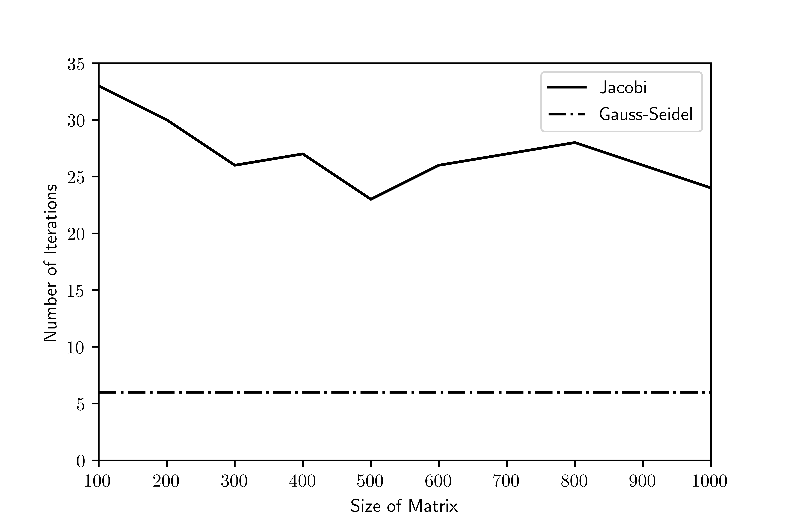

# Homework 6 Task 8: Comparing Number of Iterations For Jacobi Iteration and Gauss-Seidel

*Task: Compare the Jacobi and Gauss-Seidel in terms of the number of iterations needed to converge to a given tolerance. For example, compute the number of iterations needed to produce a solution to within four digits of accuracy. Tabulate and/or plot the number of iterations needed for the two methods as the size of the system changes. Do this for large systems of equations - greater than 500 by 500.*

This process can be executed in Fortran with the following code.

```fortran
INTEGER :: maxiter, i
REAL*8, ALLOCATABLE :: A(:, :), b(:), x(:), xg(:)
REAL*8 :: tol, error
INTEGER :: nlist(10)

nlist = (/100, 200, 300, 400, 500, 600, 700, 800, 900, 1000/)

maxiter = 1000
tol = 1e-5
DO i = 1, 10
    WRITE(*,*) "n = ", nlist(i)
    WRITE(*,*) "-----------------"
    IF (ALLOCATED(A)) DEALLOCATE(A)
    IF (ALLOCATED(b)) DEALLOCATE(b)
    IF (ALLOCATED(x)) DEALLOCATE(x)
    IF (ALLOCATED(xg)) DEALLOCATE(xg)
    ALLOCATE(A(nlist(i), nlist(i)), b(nlist(i)), x(nlist(i)), xg(nlist(i)))
    CALL mat_dd(nlist(i), A)
    CALL rand_mat(nlist(i), 1, b)
    x = 0.D0
    WRITE(*,*) "Gauss-Seidel"
    CALL gaussseidel_solve(A, nlist(i), b, tol, maxiter, x)
    xg = 0.D0
    WRITE(*,*) "Jacobi"
    CALL jacobi_solve(A, nlist(i), b, tol, maxiter, xg)
    CALL abs_err_vecl2(x, xg, nlist(i), error)
    WRITE(*,*) "l2"
    WRITE(*,*) error
END DO
```


The output of running the Hilbert matrices can be seen in the following figure:



This figure shows that the Gauss-Seidel algorithm is able to consistently converge to 5 decimal places within 6 iterations, while the Jacobi iteration takes significantly more iterations (an average of about 25) across the different sizes of matrices.

