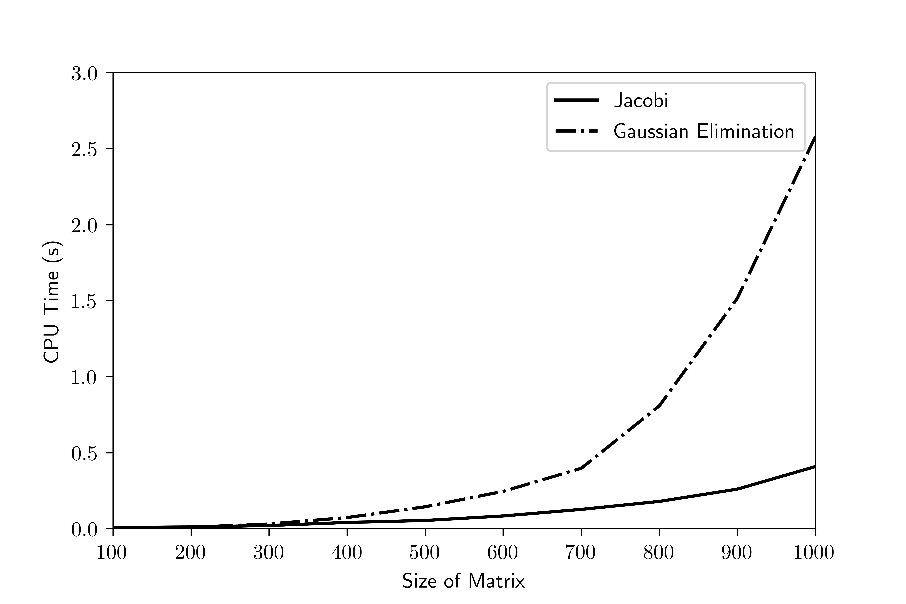
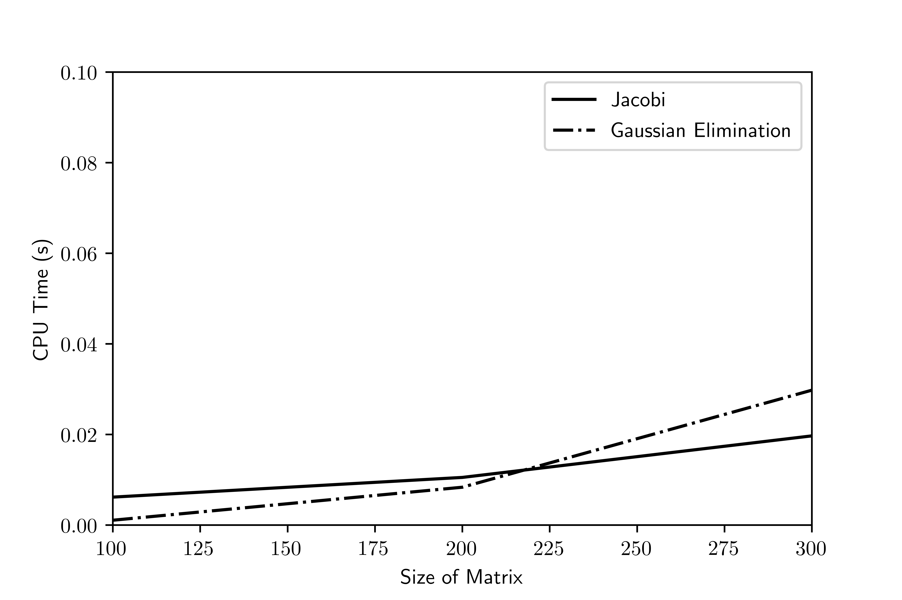

# Homework 7 Task 1: Jacobi Iteration vs. Gaussian Elimination CPU Time Comparison

*Task: Compare the results for the Jacobi iteration and Gaussian elimination on matrices that are diagonally dominant. Tabulate the CPU time necessary to complete the iteration to a given number of digits of accuracy. Tabulate results for successfully larger matrices. Is there an intersection for the curves?*

This process can be executed in Fortran with the following code.

```fortran
INTEGER :: maxiter, i
REAL*8, ALLOCATABLE :: A(:, :), b(:), x(:), xg(:), Ab(:, :)
REAL*8 :: tol, error, t1, t2
INTEGER :: nlist(10)

nlist = (/100, 200, 300, 400, 500, 600, 700, 800, 900, 1000/)

maxiter = 1000
tol = 10.D-15
DO i = 1, 10
    WRITE(*,*) "n = ", nlist(i)
    WRITE(*,*) "-----------------"
    IF (ALLOCATED(A)) DEALLOCATE(A)
    IF (ALLOCATED(b)) DEALLOCATE(b)
    IF (ALLOCATED(x)) DEALLOCATE(x)
    IF (ALLOCATED(xg)) DEALLOCATE(xg)
    IF (ALLOCATED(Ab)) DEALLOCATE(Ab)
    ALLOCATE(A(nlist(i), nlist(i)), b(nlist(i)), x(nlist(i)), xg(nlist(i)),
    Ab(nlist(i), nlist(i) + 1))
    CALL mat_dd(nlist(i), A)
    CALL rand_mat(nlist(i), 1, b)
    Ab(:, :nlist(i)) = A
    Ab(:, nlist(i) + 1) = b
    x = 0.D0
    WRITE(*,*) "Jacobi"
    CALL CPU_TIME(t1)
    CALL jacobi_solve(A, nlist(i), b, tol, maxiter, x)
    CALL CPU_TIME(t2)
    WRITE(*,*) t2 - t1
    xg = 0.D0
    WRITE(*,*) "Gaussian elimination"
    CALL CPU_TIME(t1)
    CALL direct_ge_bsin(Ab, nlist(i), nlist(i) + 1, xg)
    CALL CPU_TIME(t2)
    WRITE(*,*) t2 - t1
END DO
```

The results can be seen below for matrices from size 100 to 1000:



Perhaps unsurprisingly, Jacobi iteration for larger matrices is superior to the Gaussian Elimination routine in terms of computational time. However, when looking at matrices from 100 x 100 to 300 x 300, the story is different, as seen below



The Gaussian elimination is actually faster than the Jacobi iteration when run on a matrix that is smaller than 200 x 200. This is because it takes more work to guess and iterate than to do the number of elementary operations required to solve the system.