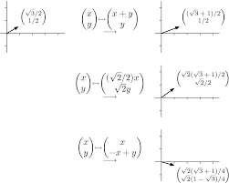

# Computational Linear Algebra Library

## About This Library

This library implements several numerical linear algebra techniques for solving systems of equations, finding eigenvalues and decomposition techniques.

These are implemented in *Fortran* to optimize for speed and to better familiarize myself with the environment.

Since this was part of the Utah State University MATH 5610 course requirements, an application of these methods to solve linear algebra problems is included in addition to the software manual itself, which gives a thorough introduction to each implemenation and includes examples.

## [Software Manual](Software_Manual/SWMToC.md)

## [Applications](./HomeworkToC.md)

Contact Me: [christianrbolander@gmail.com](mailto:christianrbolander@gmail.com)
