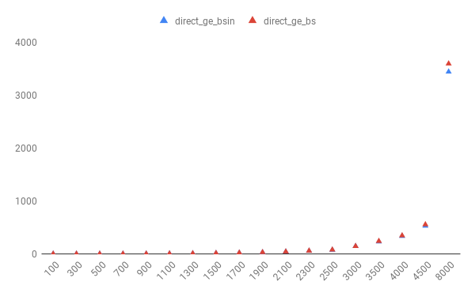

# Math 5610 Computational Linear Algebra and Solution of Systems of Equations Software Manual

This is a part of the student software manual project for Math 5610: Computational Linear Algebra and Solution of Systems of Equations. 

**Routine Name:**           direct_ge_bsin

**Author:** Christian Bolander

**Language:** Fortran. This code can be compiled using the GNU Fortran compiler by

```$ gfortran -c direct_ge_bsin.f90```

and can be added to a program using

```$ gfortran program.f90 direct_ge_bsin.o ``` 

**Description/Purpose:** This routine uses in-line versions of the subroutines `mat_row_ech` and `backsub` to solve a square linear system of equations such as

<a href="https://www.codecogs.com/eqnedit.php?latex=\mathbf{A}{\mathbf{x}}&space;=&space;\vv{\mathbf{b}}" target="_blank"></a>

using Gaussian elimination to reduce the augmented coefficient matrix to row echelon form and then apply the backward substitution method to find an approximate solution for ***x***. ***Since the row echelon form conversion and backward substitution are done in-line, this Gaussian Elimination method is much faster than `direct_ge_bs`.*** The augmented coefficient matrix is defined by

<a href="https://www.codecogs.com/eqnedit.php?latex=\left[&space;\begin{array}{ccc|c}&space;a_{11}&space;&&space;a_{12}&space;&&space;a_{13}&space;&&space;b_{1}&space;\\&space;0&space;&&space;a_{22}&space;&&space;a_{23}&space;&&space;b_{2}&space;\\&space;0&space;&&space;0&space;&&space;a_{33}&space;&&space;b_{3}&space;\\&space;\end{array}&space;\right]" target="_blank"></a>

The Gaussian elimination process computes the action of the inverse of ***A*** on ***b***.

**Input:** 

*m* : INTEGER - number of rows in the augmented coefficient matrix *A* (corresponds to the length of the solution vector *x*)

*n* : INTEGER - number of columns in the augmented coefficient matrix *A* (includes the square matrix x as well as the )

*aug_A* : REAL - augmented coefficient matrix of size *m* x *n*

**Output:** 

*x* : REAL - the solution to the system of equations in *aug_A*

**Usage/Example:**

This routine can be implemented in a program as follows

```fortran
INTEGER :: n, m, i
REAL*8, ALLOCATABLE :: A(:, :), x(:)

n = 4
m = 3
ALLOCATE(A(1:m, 1:n), x(1:m))
A = RESHAPE((/2.D0, 3.D0, 3.D0, -3.D0, &
			& 1.D0, -3.D0, 5.D0, 8.D0, &
			& 4.D0, 4.D0, 12.D0, 4.D0/), (/m, n/), ORDER=(/2, 1/))
CALL direct_ge_bsin(A, m, n, x)
WRITE(*,*) x
```

The outputs from the above code:

```fortran
  -1.7999999999999994       -1.1000000000000003        1.2999999999999998   
```

A comparison in computational time for `direct_ge_bsin` and `direct_ge_bs` can be implemented as follows

```fortran
PROGRAM main
IMPLICIT NONE

INTEGER :: n(1:17), m(1:17), i, j, base
REAL*8, ALLOCATABLE :: A(:, :), x(:)
REAL*8 :: t1_i, t2_i, t1, t2

base = 0
DO j = 1, 17
	n(j) = base + (j-1)*500 + 1
	m(j) = base + (j-1)*500
END DO
DO i = 1, 17
	WRITE(*,*) m(i)
	WRITE(*,*) "-----------------"
	IF (ALLOCATED(A)) DEALLOCATE(A)
	IF (ALLOCATED(x)) DEALLOCATE(x)
	ALLOCATE(A(1:m(i), 1:n(i)), x(1:m(i)))
	CALL rand_mat(m(i), n(i), A)
	CALL CPU_TIME(t1_i)
	CALL direct_ge_bsin(A, m(i), n(i), x)
	CALL CPU_TIME(t2_i)
	WRITE(*,*) t2_i - t1_i
	CALL CPU_TIME(t1)
	CALL direct_ge_bs(A, m(i), n(i), x)
	CALL CPU_TIME(t2)
	WRITE(*,*) t2 - t1
END DO

END PROGRAM
```

with the output seen below with the value of `m` given.

```fortran
         100
 -----------------
   9.5100000000000002E-004
   4.6160000000000003E-003
         300
 -----------------
   1.1191000000000001E-002
   2.9197000000000001E-002
         500
 -----------------
   7.6318999999999998E-002
  0.14300099999999999     
         700
 -----------------
  0.22849000000000003     
  0.39683999999999997     
         900
 -----------------
   1.2918540000000003     
   1.5442640000000001     
        1100
 -----------------
   3.6654459999999993     
   3.9832510000000001     
        1300
 -----------------
   6.9960100000000018     
   7.5361089999999997     
        1500
 -----------------
   11.696290000000001     
   12.560374000000003     
        1700
 -----------------
   18.502217000000002     
   19.629311999999999     
        1900
 -----------------
   27.039949000000007     
   28.709844000000018     
        2100
 -----------------
   39.153564999999986     
   41.175299999999993     
        2300
 -----------------
   54.051498000000009     
   57.373232999999971 
        2500
 -----------------
   72.672651999999999     
   76.668656999999996     
        3000
 -----------------
   143.29303199999998     
   144.55856800000004     
        3500
 -----------------
   229.23474700000003     
   240.15702400000009     
        4000
 -----------------
   335.23263600000007     
   345.11590299999989     
        4500
 -----------------
   529.49505899999986     
   554.27776499999982
        8000
 -----------------
   3441.6954460000002     
   3594.6079899999995
```



**Implementation/Code:** The code for direct_ge_bsin can be seen below.

```fortran
SUBROUTINE direct_ge_bsin(aug_A, m, n, x)
	IMPLICIT NONE
	
	! Takes as inputs an augmented coefficient matrix, `aug_A` of size
	! `m` x `n` and outputs the solution when using Gaussian Elimination
	! and backward substitution, `x` of length `n`.
	INTEGER, INTENT(IN) :: m, n
	REAL*8, INTENT(INOUT) :: aug_A(1:m, 1:n)
	REAL*8, INTENT(OUT) :: x(1:n)
	
	
	! Initialize decrement variables and a variable to compute the sum
	! of previous solutions integrated into the algorithm for the 
	! backward substitution method.
	INTEGER :: k_b, j_b
	REAL*8 :: backsum
	
	! Initialize increment variables i, j, and k as well as a factor
	! variable to be used in the row echelon algorithm.
	INTEGER :: i, j, k
	REAL*8 :: factor
	
	
	! Executes the `mat_row_ech` subroutine inline to take `aug_A` to
	! row echelon form.
	
	! Loop across all columns except for the last (never need to touch
	! that entry to cancel out what is below it). This targers the pivot
	! elements
	DO k = 1, n - 1
	
		! Loop through all of the rows except for the first one to make
		! them zeros using the algorithm. Makes all entries zero beneath
		! the pivot element.
		DO i = k + 1, m
		
			! Calculate the factor to reduce ith row value to zero
			factor = aug_A(i, k)/aug_A(k, k)
			
			! Loop through all columns to subtract the factor multiplied
			! by the previous row entry.
			DO j = k , n
				aug_A(i, j) = aug_A(i, j) - factor*aug_A(k, j)
			END DO
		END DO
	END DO
	
	! Executes the `backsub` subroutine inline to find the solution to
	! the system of equations in `aug_A`.
	
	! Calculate the last value in the solution vector `x`.
	x(m) = aug_A(m, n)/aug_A(m, n - 1)
	
	! Loop through the remaining rows in `x` to calculate the solution
	! using the backward substitution algorithm.
	DO k_b = m-1, 1, -1
		backsum = 0.D0
		DO j_b = k_b + 1, n
			backsum = backsum + aug_A(k_b, j_b)*x(j_b)
		END DO
		x(k_b) = (aug_A(k_b, n) - backsum)/aug_A(k_b, k_b)
	END DO
	
	
END SUBROUTINE
```


